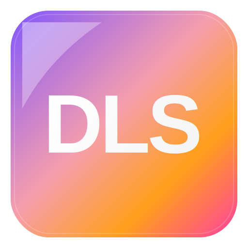

<p align="center">
  <a href="https://yuutamw.github.io/WEB-project-No.-2/login.html">
    
  </a>
</p>

<h1 align="center">DLS — Dynamic Lecture System</h1>

<p align="center">
  A live lecture platform for uploading presentations, opening class sessions,
  joining by room code / QR, and asking questions directly on the slide.
</p>

## Production Branch :
<a href="https://github.com/YuutamW/WEB-project-No.-2/tree/dashboard-core-layout-refactor">
  
</a>

---

<p align="center">
  
  
  
  
  
  
</p>

<p align="center">
  <a href="https://yuutamw.github.io/WEB-project-No.-2/">
    
  </a>
  <a href="https://dls-backend-uelx.onrender.com/">
    
  </a>
  <a href="https://www.figma.com/design/9i2kHP9lS4gbiZunjcRXXg/DLS---Dynamic-Lecture-System?node-id=0-1&p=f&t=apUaMVJGVwu2voGb-0">
    
  </a>
  <a href="https://github.com/users/DorManDel/projects/2/views/2">
    
  </a>
  <a href="https://wntrb1st-6589366.postman.co/workspace/yotam-wntrb%27s-Workspace~e10001c2-2a1d-4108-8b48-55d61a2c34a4/request/54631479-644eec6d-7064-43f7-baaf-0398f8db7ab8?tab=params">
    
  </a>
  <a href="https://github.com/DorManDel/DLS-Backend/blob/V1-Sessions_and_Questions_db_integrations/ListOfModulesAndApis.md">
    
  </a>
</p>

---

> [!WARNING]
> **Demo environment only.** Do not use real passwords, private tokens, API keys, personal documents, or sensitive information in this project demo.

---

## Overview

**DLS** is a **Dynamic Lecture System** built for live classroom interaction.

A lecturer can upload a PDF presentation, start a live session, share a room code or QR code with students, and receive student questions in real time. Students can join the session from their dashboard, view the shared presentation, add questions on top of the slide, and open a Q&A panel during the lecture.

---

## Live Links

| Resource | Link |
|---|---|
| Frontend | [Live Frontend – GitHub Pages](https://yuutamw.github.io/WEB-project-No.-2/) |
| Backend API | [Live Backend – Render](https://dls-backend-uelx.onrender.com/) |
| Figma | [DLS Design File](https://www.figma.com/design/9i2kHP9lS4gbiZunjcRXXg/DLS---Dynamic-Lecture-System?node-id=0-1&p=f&t=apUaMVJGVwu2voGb-0) |
| GitHub Project Board | [DLS Project Board](https://github.com/users/DorManDel/projects/2/views/2) |
| Postman | [DLS API Workspace](https://wntrb1st-6589366.postman.co/workspace/yotam-wntrb%27s-Workspace~e10001c2-2a1d-4108-8b48-55d61a2c34a4/request/54631479-644eec6d-7064-43f7-baaf-0398f8db7ab8?tab=params) |
| Backend Modules & APIs | [ListOfModulesAndApis.md](https://github.com/DorManDel/DLS-Backend/blob/V1-Sessions_and_Questions_db_integrations/ListOfModulesAndApis.md) |

---

<details open>
<summary><strong>Core Demo Flow</strong></summary>

<br>

| Step | User / System | Action |
|---:|---|---|
| 1 | Lecturer | Logs in and opens the lecturer dashboard |
| 2 | Lecturer | Uploads a PDF presentation |
| 3 | Lecturer | Starts a live lecture session |
| 4 | System | Generates a room code and QR join link |
| 5 | Student | Joins the session from the student dashboard |
| 6 | Student | Views the shared PDF presentation |
| 7 | Student | Adds a question on a slide position |
| 8 | Backend | Saves the question and broadcasts it through Socket.IO |
| 9 | Lecturer | Receives the question live in the Q&A drawer |
| 10 | Lecturer | Opens the question summary / ends the session |

```txt
Lecturer Login
→ Lecturer Dashboard
→ Upload PDF
→ Start Live Session
→ Share Room Code / QR
→ Student Joins
→ Student Adds Question
→ Backend Saves Question
→ Socket.IO Broadcasts Question
→ Lecturer Q&A Drawer Updates
→ Summary
```

</details>

---

<details open>
<summary><strong>Main Features</strong></summary>

<br>

### Lecturer

- Login and lecturer dashboard
- Upload PDF presentation
- Start a live lecture session
- Generate room code and QR join link
- View connected participants
- Navigate presentation pages
- See live student questions
- Show / hide Q&A drawer
- Open question summary
- End lecture session

### Student

- Login and student dashboard
- Join lecture by room code / QR
- View shared presentation
- Add questions directly on the PDF
- See question markers on the slide
- Open / close Q&A drawer
- View personal questions from dashboard
- Leave lecture session

### Realtime

- Socket.IO room per lecture session
- Live question creation
- Live Q&A update
- Session room join events
- Session end event foundation
- Follow lecturer page-sync foundation

</details>

---

<details open>
<summary><strong>Project Pages</strong></summary>

<br>

| Page | Live Link | Purpose |
|---|---|---|
| `index.html` | [Open Landing / Register](https://yuutamw.github.io/WEB-project-No.-2/index.html) | Public entry and registration page |
| `login.html` | [Open Login](https://yuutamw.github.io/WEB-project-No.-2/login.html) | Login page for students and lecturers |
| `dashboard.html` | [Open Lecturer Dashboard](https://yuutamw.github.io/WEB-project-No.-2/dashboard.html) | Lecturer workspace and session control |
| `student-dashboard.html` | [Open Student Dashboard](https://yuutamw.github.io/WEB-project-No.-2/student-dashboard.html) | Student workspace, session join and personal questions |
| `presentation.html` | [Open Presentation Viewer](https://yuutamw.github.io/WEB-project-No.-2/presentation.html) | Live PDF presentation, Q&A, toolbar and room session |

</details>

---

<details open>
<summary><strong>Frontend Tech Stack</strong></summary>

<br>

| Layer | Technologies | Role |
|---|---|---|
| UI |    | Builds the browser interface without a frontend framework |
| Presentation Viewer |  | Renders PDF files inside the browser |
| API Communication |  | Sends HTTP requests from the browser to the DLS backend |
| Realtime Client |  | Connects the browser to live lecture rooms and Q&A events |
| Browser State | `localStorage` | Stores current user, current session and client-side UI state |
| Hosting |  | Hosts the static frontend files |

</details>

---

<details open>
<summary><strong>Connected Services</strong></summary>

<br>

The frontend does **not** connect directly to MongoDB and does **not** run Node.js, Express, Mongoose, Multer or dotenv.

All persistent data is handled through the DLS backend API.

| Service | Link | How the frontend uses it |
|---|---|---|
| DLS Backend API | [Live Backend – Render](https://dls-backend-uelx.onrender.com/) | Users, sessions, questions, PDF upload/fetch and summary data |
| Socket.IO Server | DLS Backend Socket.IO server | Live Q&A updates, session rooms and realtime events |
| Google Calendar Embed | Embedded iframe | Demo calendar inside dashboards |
| Google Fonts | Heebo font | Loads the main project font |
| Postman Workspace | [DLS API Workspace](https://wntrb1st-6589366.postman.co/workspace/yotam-wntrb%27s-Workspace~e10001c2-2a1d-4108-8b48-55d61a2c34a4/request/54631479-644eec6d-7064-43f7-baaf-0398f8db7ab8?tab=params) | API testing and documentation resource |

</details>

---

<details>
<summary><strong>Frontend / Backend Ownership Boundary</strong></summary>

<br>

The frontend only sends requests and listens to realtime events.

| Responsibility | Owned By |
|---|---|
| Rendering pages and UI | Frontend |
| PDF display in browser | Frontend with PDF.js |
| Current user/session browser state | Frontend with `localStorage` |
| HTTP requests to backend | Frontend with Fetch API |
| Realtime connection | Frontend with Socket.IO client |
| User signup/login persistence | Backend |
| Session creation and joining | Backend |
| PDF upload receiving | Backend with Multer |
| PDF storage / streaming | Backend / MongoDB GridFS |
| Question saving | Backend |
| Database models | Backend with Mongoose |
| Environment variables | Backend with `.env` / dotenv |
| Realtime room broadcasting | Backend Socket.IO server |

</details>


---

<details>
<summary><strong>Presentation Viewer Architecture</strong></summary>

<br>

The presentation page uses layered rendering:

```txt
slideWrapper
│
├── PDF Canvas Layer
├── Question Marker Layer
├── Annotation Layer
├── DOM Layer
└── Toolbar / Drawer UI
```

Question markers are saved with relative coordinates:

```js
{
  page: 2,
  x: 0.42,
  y: 0.31
}
```

This keeps markers in the correct position even when the PDF size changes.

</details>

---

## Workflows

<details open>
<summary><strong>PDF Upload and Rendering Workflow</strong></summary>

<br>

DLS uses a browser-to-backend upload flow for lecture presentations.

```txt
Lecturer selects a PDF file
→ Frontend creates FormData
→ Frontend sends the PDF to the backend
→ Backend receives the file using Multer
→ Backend stores/serves the PDF for the live session
→ Student joins the session
→ Frontend requests the session PDF
→ Backend returns the PDF file
→ Frontend converts the response to a Blob
→ PDF.js renders the Blob inside the presentation viewer
```

Important distinction:

| Part | Responsibility |
|---|---|
| `FormData` | Browser object used to send the selected PDF file |
| `Multer` | Backend middleware that receives uploaded PDF files |
| `GridFS / MongoDB` | Backend storage / streaming layer for uploaded file data |
| `fetch(...).blob()` | Browser conversion of the PDF response into a Blob |
| `PDF.js` | Browser rendering engine for the PDF pages |
| Relative coordinates | Keep question markers aligned on the rendered PDF |

</details>

<details open>
<summary><strong>Questions Workflow</strong></summary>

<br>

Questions are created directly from the live presentation viewer.

```txt
Student selects Question tool
→ Student clicks a location on the PDF
→ Question popup opens
→ Student writes a question
→ Frontend calculates relative x/y coordinates
→ Frontend sends POST /api/questions
→ Backend saves the question
→ Backend emits question:created through Socket.IO
→ Lecturer and students receive the live update
→ Q&A drawer and question markers refresh
```

Question position example:

```js
{
  code: "90C56A",
  sessionId: "90C56A",
  page: 2,
  x: 0.42,
  y: 0.31,
  text: "Can you explain this part?",
  status: "open",
  color: "#ff3b6b",
  studentName: "Anonymous"
}
```

The `x` and `y` values are relative coordinates.  
This keeps question markers aligned correctly across desktop, tablet and mobile screens.

</details>

<details open>
<summary><strong>Socket.IO Realtime Workflow</strong></summary>

<br>

Each live lecture session uses a dedicated Socket.IO room.

```txt
Room format:
presentation:<sessionCode>
```

Example:

```txt
presentation:90C56A
```

Main realtime flow:

```txt
Lecturer creates a session
→ Lecturer joins Socket.IO room
→ Student joins the same room
→ Student sends a question
→ Backend saves the question
→ Backend emits question:created to the room
→ Lecturer receives the question live
→ Q&A drawer updates without manual refresh
```

Main events:

| Event | Direction | Purpose |
|---|---|---|
| `presentation:join` | Client → Server | Join a live presentation room |
| `presentation:joined` | Server → Client | Confirm room connection |
| `question:created` | Server → Clients | Broadcast a new question |
| `session:participantsUpdated` | Server → Clients | Update participant count/list |
| `session:ended` | Server → Clients | Notify users that the session ended |
| `presentation:page-changed` | Client ↔ Server | Foundation for follow lecturer page sync |

</details>

---

<details>
<summary><strong>Important Local Storage Keys</strong></summary>

<br>

| Key | Purpose |
|---|---|
| `dlsCurrentUser` | Current logged-in user |
| `dlsCurrentSession` | Current live session |
| `dlsQuestionClientColor` | Stable client-side question color |

</details>

---

<details>
<summary><strong>Related Backend Documentation</strong></summary>

<br>

The frontend communicates with a custom DLS backend API.

Backend implementation details are documented separately:

[Open Backend Modules and API Map](https://github.com/DorManDel/DLS-Backend/blob/V1-Sessions_and_Questions_db_integrations/ListOfModulesAndApis.md)

Frontend-facing backend areas:

| Area | Purpose |
|---|---|
| Users API | Signup, login and user settings |
| Sessions API | Create, join, load and end live sessions |
| PDF API | Upload and fetch session presentations |
| Questions API | Save and load lecture questions |
| Socket.IO | Live Q&A and session room events |

</details>

---

<details open>
<summary><strong>Current Status</strong></summary>

<br>

This is a working live prototype. The main frontend flow is connected to the backend and supports live sessions, PDF upload, Socket.IO rooms, and Q&A behavior.

Implemented:

- Frontend dashboard flow
- Lecturer and student dashboards
- PDF upload and rendering
- Live session creation
- Room code / QR flow
- Socket.IO room connection
- Live questions
- Q&A drawer
- Question markers
- Question summary foundation

Still in progress:

- Follow lecturer page sync
- Full annotation saving
- Full layer system
- Better old-session replay mode
- Final mobile/tablet polishing
- Production-level authentication hardening

</details>

---

<details>
<summary><strong>Team Workflow</strong></summary>

<br>

Work is tracked through the [DLS GitHub Project Board](https://github.com/users/DorManDel/projects/2/views/2).

```txt
Create branch
→ Implement small feature/fix
→ Test locally
→ Commit
→ Push
→ Deploy
→ Verify live behavior
```

</details>

---

## Security & Demo Notice

> [!IMPORTANT]
> DLS is an academic live prototype.

> [!WARNING]
> Do not use real passwords, private tokens, API keys, personal documents, or sensitive information in demo environments.

For testing, use only demo users, demo PDFs and non-sensitive lecture materials.

---

## Thank you for reading :)
